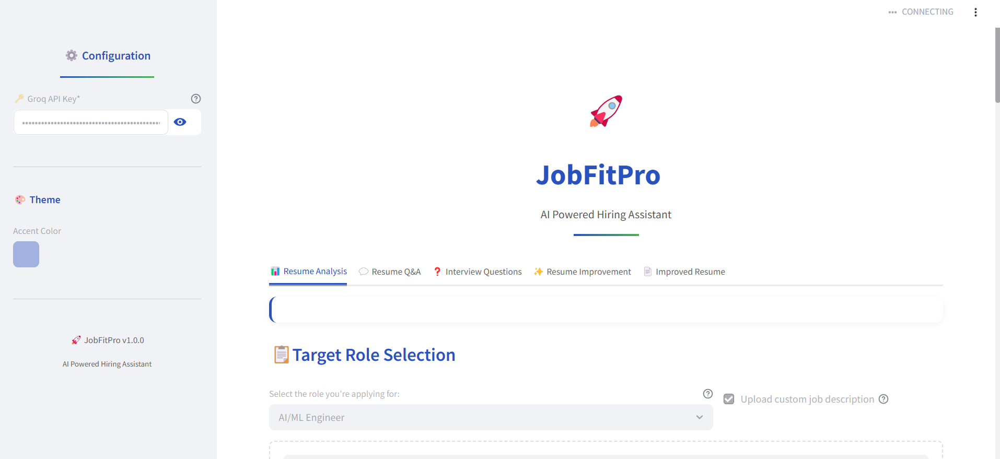
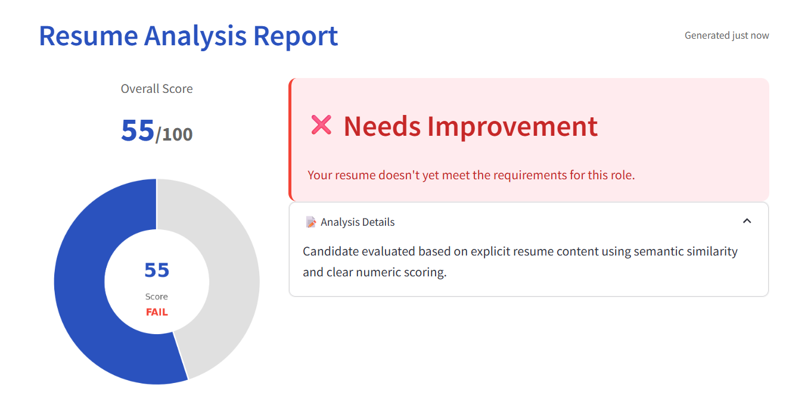
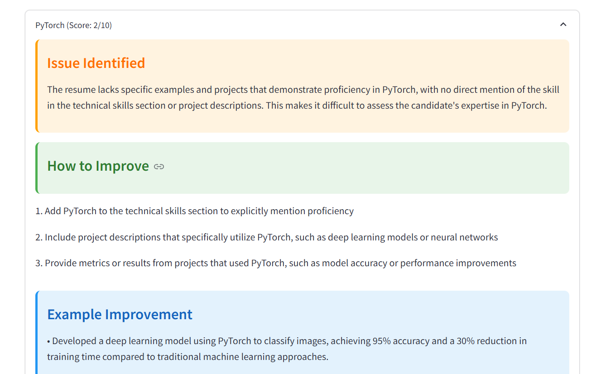
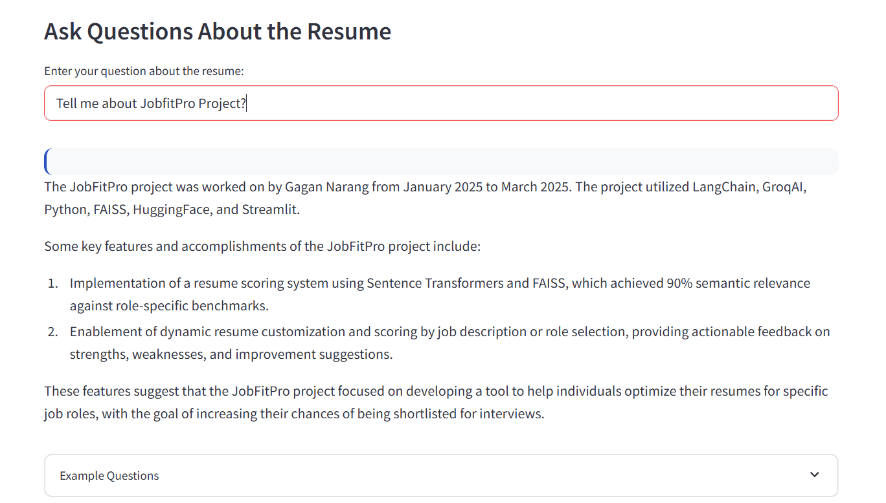
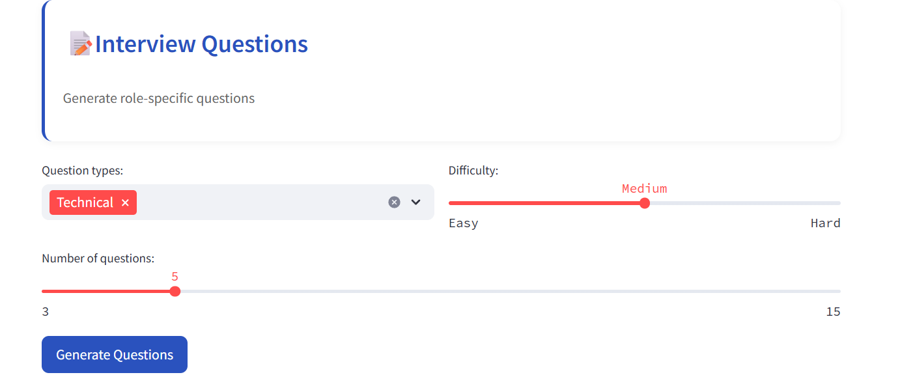

# JobFitPro - AI-Powered Hiring Assistant 🚀

 <!-- Add a screenshot later -->





## Features ✨

- **Smart Resume Analysis**: AI-powered evaluation against job descriptions
- **Custom JD Matching**: Upload any job description for personalized scoring
- **Skill Gap Identification**: Discover missing skills for your target role
- **Resume Improvement**: Get actionable suggestions to optimize your resume
- **Interview Prep**: Generate personalized interview questions
- **ATS Optimization**: Improve resume formatting for applicant tracking systems

## Installation 💻

1. **Clone the repository**:
   ```bash
   git clone https://github.com/yourusername/JobFitPro.git
   cd JobFitPro

3. **Make the environmentand install dependencies**
   python -m venv venv
   source venv/bin/activate  # Linux/Mac
   venv\Scripts\activate     # Windows
   pip install -r requirements.txt

4. **run the app**
   streamlit run app.py